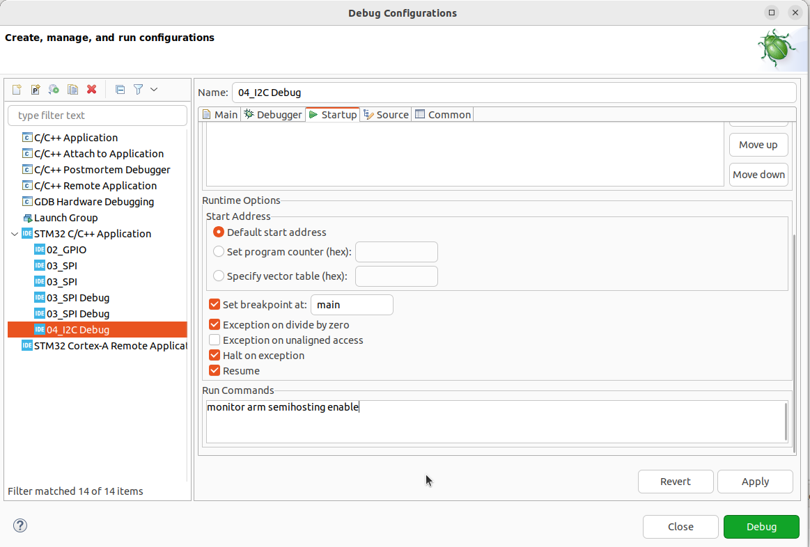

# Embedded C Printf Methods

This repository provides a comprehensive guide on different methods for implementing the `printf` function in Embedded C. The examples cover using `printf` via UART, SWD (Serial Wire Debug), and OpenOCD.

## Table of Contents

- [Embedded C Printf Methods](#embedded-c-printf-methods)
  - [Table of Contents](#table-of-contents)
  - [Introduction](#introduction)
  - [Getting Started](#getting-started)
    - [Prerequisites](#prerequisites)
  - [Printf via SWD](#printf-via-swd)
    - [Overview](#overview)
    - [Implementation](#implementation)
  - [Printf via SWD](#printf-via-swd-1)
    - [Overview](#overview-1)
    - [Implementation](#implementation-1)
  - [Printf via OpenOCD](#printf-via-openocd)
    - [Overview](#overview-2)
    - [Implementation](#implementation-2)

## Introduction

This repository aims to help embedded system developers to implement `printf` functionalities using different communication protocols commonly used in embedded systems. This can be especially useful for debugging and monitoring embedded applications.

## Getting Started

### Prerequisites

Before you begin, ensure you have met the following requirements:
- You have a C compiler installed.
- You have access to the necessary hardware for UART, SWD, and OpenOCD communication.
- You have Git installed on your computer.

## Printf via SWD

### Overview

Serial Wire Debug (SWD) is a debug port that enables code debugging and trace through a single wire. Redirecting `printf` output to SWD can be useful for real-time monitoring.

### Implementation

1. **Setting Up SWD:**
- Configure the microcontroller for SWD communication.
- Ensure your development environment supports SWD.

2. **Printing via SWD:**
- Use specific libraries or functions provided by the microcontroller's SDK to send `printf` data through SWD.

3. **Example Code:*


## Printf via SWD

### Overview

Serial Wire Debug (SWD) is a debug port that enables code debugging and trace through a single wire. Redirecting `printf` output to SWD can be useful for real-time monitoring.

### Implementation

1. **Setting Up SWD:**
- Configure the microcontroller for SWD communication.
- Ensure your development environment supports SWD.

2. **Printing via SWD:**
- Use specific libraries or functions provided by the microcontroller's SDK to send `printf` data through SWD.

3. **Example Code:**


## Printf via OpenOCD

### Overview

OpenOCD (Open On-Chip Debugger) supports various debugging interfaces including JTAG and SWD. Redirecting `printf` output through OpenOCD can be done using specific configurations and scripts.

### Implementation

1. **Add semi-hosting run command**

First in the debug configuration page, change the debug probe to OpenOCD:


After this, put in the startup the following command:

```
monitor arm semihosting enable
```




2. **Set the linker arguments:**
  
```
specs=rdimon.specs -lc -lrdimon
```


- Redirect `printf` output through GDB and OpenOCD.

1. **Example Code:**


